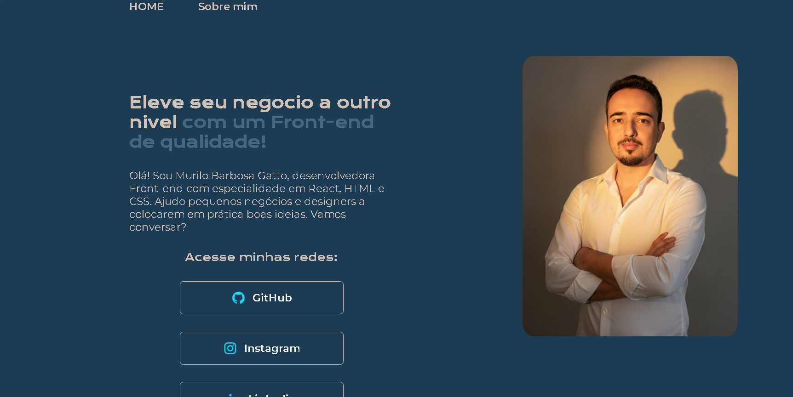

# Portfólio - Projeto Alura

Este é um projeto de uma página de portfólio pessoal desenvolvido como parte dos estudos no curso de HTML e CSS da Alura. A página foi construída utilizando HTML para a estrutura e CSS para a estilização, com foco em boas práticas e design responsivo.



## 🚀 Sobre o Projeto

O objetivo deste projeto é criar uma página de apresentação (landing page) que funcione como um portfólio online. A página inclui:
- Uma seção de apresentação com uma breve biografia.
- Links para redes sociais ou outras plataformas.
- Uma imagem de perfil.
- Um cabeçalho de navegação e um rodapé.

## ✨ Tecnologias Utilizadas

-   **HTML5**: Para a estrutura semântica do conteúdo da página.
-   **CSS3**: Para a estilização completa, utilizando conceitos como:
    -   **Flexbox** para criar layouts flexíveis e alinhamento de itens.
    -   **Variáveis CSS** (Custom Properties) para manter um tema de cores e fontes consistente e fácil de manter.
    -   **Fontes customizadas** importadas do Google Fonts (`Krona One` e `Montserrat`) para uma tipografia única.

## 📂 Estrutura de Arquivos

A estrutura do projeto está organizada da seguinte forma:

```
.
├── styles/
│   └── style.css   # Folha de estilos principal
├── index.html      # Arquivo HTML principal da página
└── README.md       # Este arquivo de documentação
```

## 🖥️ Como Executar

Este é um projeto front-end estático, então não há necessidade de um servidor ou instalação de dependências. Para visualizar a página, basta abrir o arquivo `index.html` em seu navegador de preferência.